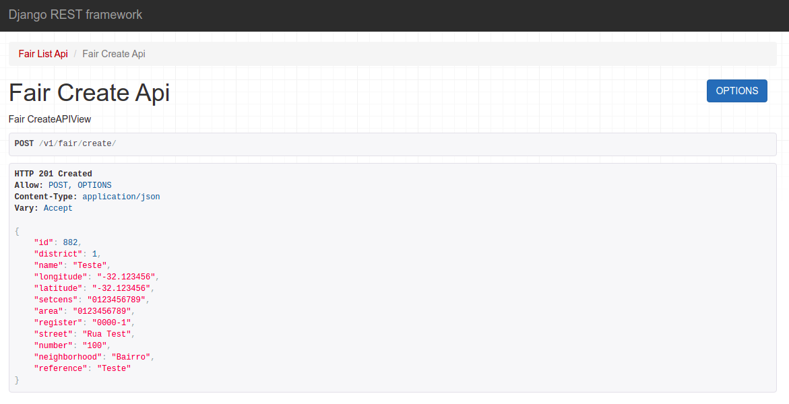
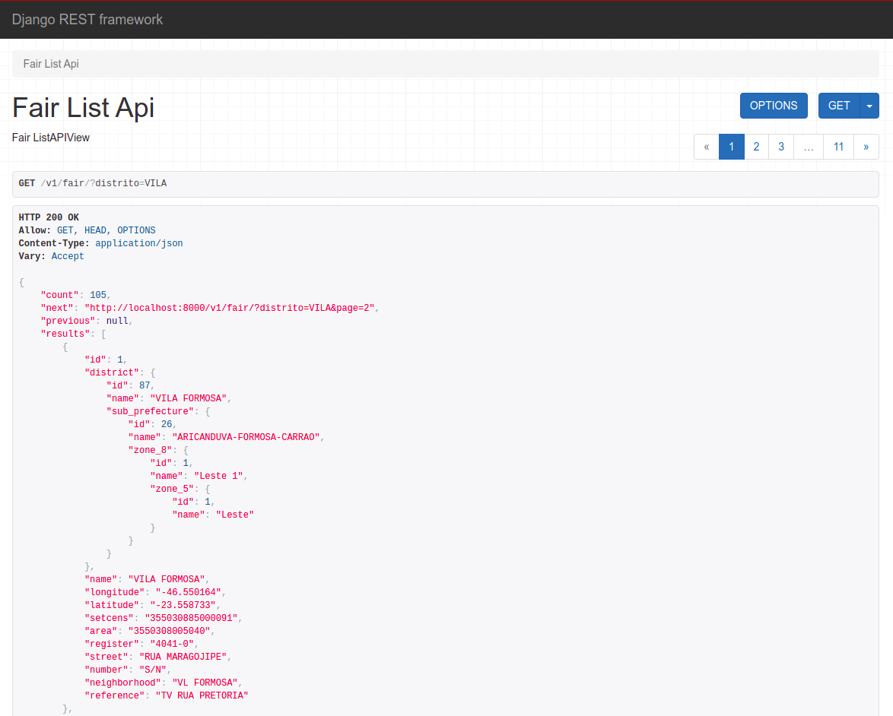
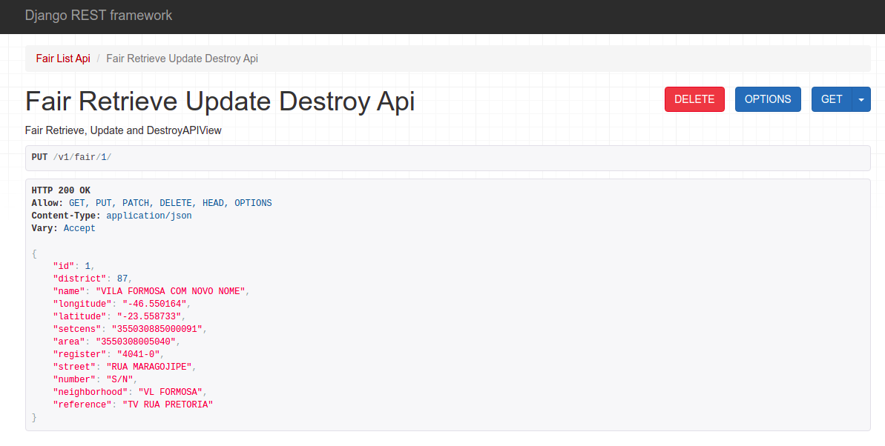
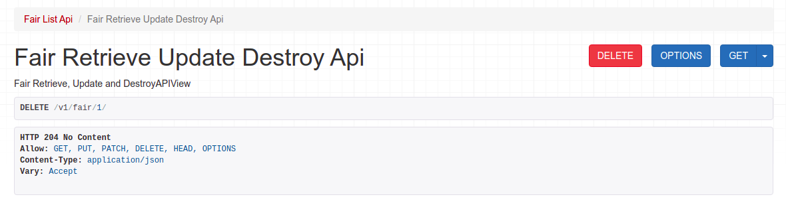

## Proposta

Desenvolver uma API que exponha os dados disponíveis em [1] utilizando uma
abordagem orientada a recursos e que atenda os requisitos listados abaixo.

## Escopo

Utilizando os dados do arquivo “DEINFO_AB_FEIRASLIVRES_2014.csv”, implemente:
* cadastro de uma nova feira;
* exclusão de uma feira através de seu código de registro;
* alteração dos campos cadastrados de uma feira, exceto seu código de registro;
* busca de feiras utilizando ao menos um dos parâmetros abaixo:
  * distrito
  * regiao5
  * nome_feira
  * bairro

## Rodando o app

### Requerimentos

Será necessário o Docker e Docker Compose.
Na primeira vez, pode ser necessário dar permissão de execução para o entrypoint. Também poderá demorar um pouco por conta do primeiro build.

```
$ chmod +x .docker/entrypoint.sh
$ docker-compose up
```

### Testando a aplicação

```
$ docker exec -it mb-backend python manage.py test
```

### Importando os dados da prefeitura

```
$ docker exec -it mb-backend python manage.py import --file .data/DEINFO_AB_FEIRASLIVRES_2014.csv
```
## Endpoints

### Cadastrando uma nova Feira

* URL: `http://localhost:8000/v1/fair/create/`
* Método: `POST`
* Dicionário
```
{
    "district": 1,
    "name": "Teste",
    "longitude": -32.123456,
    "latitude": -32.123456,
    "setcens": "0123456789",
    "area": "0123456789",
    "register": "0000-1",
    "street": "Rua Test",
    "number": "100",
    "neighborhood": "Bairro",
    "reference": "Teste"
}
```



### Listando Feiras

* URL: `http://localhost:8000/v1/fair/`
* Método: `GET`
* Parametros
 * distrito
 * regiao5
 * nome_feira
 * bairro

Exemplo de uso dos parâmetros: `http://localhost:8000/v1/fair/?distrito=VILA`



### Alterando campos

* URL: `http://localhost:8000/v1/fair/{id}/`
* Método: `PUT` our `PATCH`
* Dicionário
```
{
    "district": 1,
    "name": "Teste",
    "longitude": -32.123456,
    "latitude": -32.123456,
    "setcens": "0123456789",
    "area": "0123456789",
    "register": "0000-1",
    "street": "Rua Test",
    "number": "100",
    "neighborhood": "Bairro",
    "reference": "Teste"
}
```



### Deletando uma Feira

* URL: `http://localhost:8000/v1/fair/{id}/`
* Método: `DELETE`


